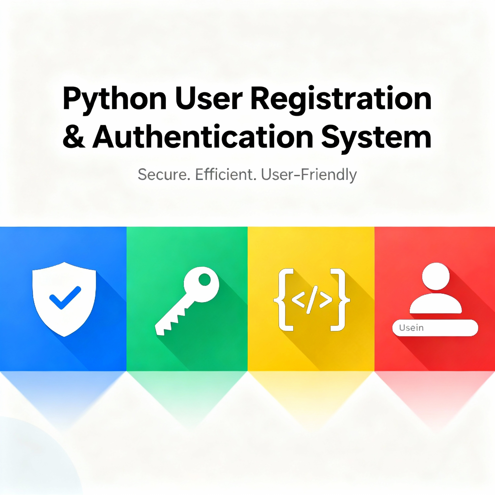

# User Registration and Authentication System in Python

## Description

A robust user registration (sign up) and authentication (sign in) system implemented in Python, showcasing best programming practices, modular design, and advanced password validation. This project uses JSON files for persistent user storage, custom exceptions for clear error handling, and decorators for logging function activity.

## Features

- User registration with advanced password validation (minimum 8 characters, uppercase letters, numbers, special characters)
- Secure user login with credential verification and error handling
- Persistent user data stored in a JSON file
- Decorators for automated logging of function calls and results
- Clean, scalable, object-oriented code design
- Custom exception classes to improve robustness and user feedback

## Technologies Used

- Python 3.x
- JSON for data persistence

## Installation

1. Clone this repository.
2. Ensure Python 3 is installed on your system.
3. Run the main script:

python main.py

4. Follow the console instructions to sign up or sign in.

## Usage

- Run the script.
- Choose to register a new user or log in.
- User data will be automatically saved to `users.json`.

## Project Structure

- `main.py`: Main script containing user management logic, validation, and CLI interface
- `users.json`: JSON file auto-generated for user data storage

## Contributing

This project is a foundation for further enhancements such as password encryption, database integration, or GUI development. Contributions, issues, and suggestions are welcome.

## License

MIT License

## Contact

Created by superTay. Feel free to connect for collaboration or feedback!
